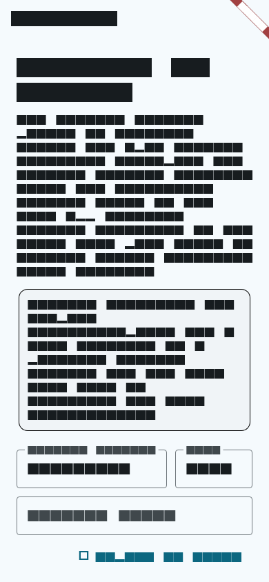
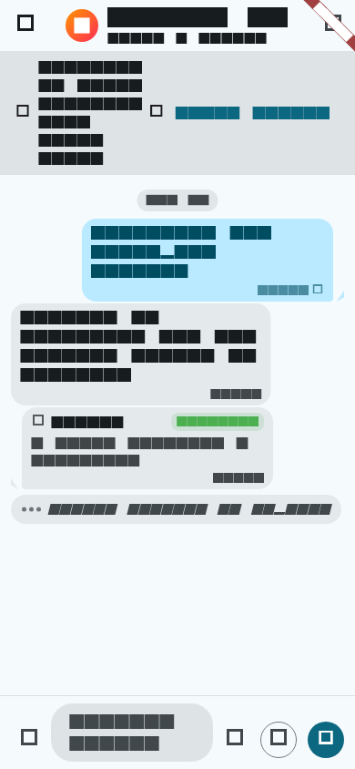

# Navivox App

**Hermes Agent mobile/desktop companion with local continuous voice.**

Navivox is a Flutter app for operating trusted local, LAN, VPN, or self-hosted Hermes Agent API servers. Fresh installs open on the native Hermes screen, connect to a Hermes endpoint, show sessions, stream assistant/tool progress, handle approvals, and can submit device-transcribed voice as normal Hermes text turns.

The older Gormes `/v1/navivox/*` UI remains only as legacy/preserved code and is not part of active Hermes readiness. New mainline work is pure Hermes endpoint/session work.

References:

- Hermes Desktop reference: <https://github.com/fathah/hermes-desktop>

## Status

Current Hermes path:

1. Connect to a Hermes Agent API server (`/hermes`).
2. Save the base URL as non-secret metadata and the optional API key in secure storage.
3. List/create/select/rename/delete/fork Hermes sessions from the Sessions panel.
4. Stream chat through capability-gated Hermes transports.
5. Render assistant deltas, tool progress cards, approval prompts, stop controls, capability/health status, read-only model/skill/toolset/job catalog counts/details, surface-readiness notes, and bounded copyable diagnostics.
6. Use local device speech capture/continuous voice to submit transcripts as Hermes text turns.

Implemented platform coverage includes Flutter web/Android/Linux plus generated iOS and Windows scaffolds. Local validation covers Dart/widget tests, focused web e2e smoke against a fake Hermes HTTP/SSE server, live connect smoke against the installed local Hermes Agent API server, provider-backed text plus transcript-voice smoke when a configured Hermes home is available, Android speech/key readiness smokes, deterministic Android continuous-voice loop smoke, Android debug APK build, Linux release build, and a published `Hermes platform smoke` workflow with watched Windows/iOS/macOS native-host job and artifact receipts in `build/receipts/hermes-platform-workflow.json`.

Still blocked without external devices or new Hermes API contracts:

- Full Android microphone/continuous-voice loop with real spoken input on a responsive audio-capable Android device or emulator.
- Hermes realtime/server audio.
- Deferred Desktop-parity surfaces listed in `docs/product/hermes-desktop-parity-roadmap.md`.

## Screenshots

The screenshots below are generated from real Flutter widgets and checked by the test suite. Some still show legacy Gormes surfaces while the Hermes-first UI is being expanded.





## Real-World Usage

Navivox is for mobile and desktop operator use: hands-free chat, project briefings, incident checks, voice task capture, approvals, and screen-reader-friendly control away from a terminal.

## Why It Is Cool

- **Hermes sessions become a mobile console.** Navivox gives Hermes Agent a touch/voice UI without copying Electron-only install/update mechanics.
- **Voice stays local-first.** Device STT can become a normal Hermes turn; no realtime/server audio API is promised until Hermes exposes one.
- **Tool work is visible.** Assistant text, tool cards, approvals, safety notices, and recovery states are UI objects rather than pasted logs.
- **Secrets stay bounded.** Hermes API keys are stored through secure storage and must not appear in shared preferences, routes, logs, notices, screenshots, or transcripts.

## Hermes Endpoint Surface

Navivox targets the Hermes Agent API server, defaulting to port `8642`:

- `GET /health`
- `GET /v1/capabilities`
- `GET /v1/models`
- `GET /v1/skills`
- `GET /v1/toolsets`
- `GET /api/jobs` (read-only when advertised)
- `GET /api/sessions`
- `POST /api/sessions`
- `PATCH /api/sessions/{session_id}`
- `DELETE /api/sessions/{session_id}`
- `GET /api/sessions/{session_id}/messages`
- `POST /api/sessions/{session_id}/fork`
- `POST /api/sessions/{session_id}/chat/stream`
- `POST /v1/runs`
- `GET /v1/runs/{run_id}/events`
- `POST /v1/runs/{run_id}/approval`
- `POST /v1/runs/{run_id}/stop`

The app gates run transport, tool progress, approvals, and stop behavior from `/v1/capabilities` and falls back to session chat when needed.

## Legacy Gormes Surfaces

Legacy Gormes screens for gateways, profile contacts, config, memory, profile seed, voice profiles, run records, and pairing handoff are preserved only for history/tests. They are not active product blockers. New mainline work should use Hermes endpoint/session language.

## Repository Layout

```text
.
├── lib/                         # Flutter app source
│   ├── core/hermes/              # Hermes API client, channel, models, SSE parser
│   └── features/hermes_chat/     # Native Hermes chat/session/voice UI
├── test/                        # Widget, unit, and tooling tests
├── integration_test/            # Connect-and-talk integration tests
├── web/                         # Flutter web shell
├── linux/                       # Flutter Linux runner
├── ios/                         # Flutter iOS runner scaffold
├── windows/                     # Flutter Windows runner scaffold
├── docs/                        # Product, architecture, research, ADRs, runbooks
├── playwright/                  # Web QA tests, probes, debug scripts, screenshots
└── CONTEXT.md                   # Shared product language
```

## Install And Run

Prerequisites:

- Flutter SDK on `PATH`
- Android SDK, browser, or another Flutter target for local app runs
- A trusted Hermes Agent API server for live connect-and-talk testing

Install dependencies from the repository root:

```bash
flutter pub get
```

Run the local verification gate:

```bash
flutter analyze
flutter test --concurrency=1
```

Find available Flutter targets:

```bash
flutter devices
```

Run the app from the repository root, replacing `<device-id>` with one of the listed targets:

```bash
flutter run -d <device-id>
```

Hermes endpoint URL hints and presets:

- `Local Hermes`: `http://127.0.0.1:8642` for desktop/Linux/Windows/iOS simulator on the same host.
- `Android emulator`: `http://10.0.2.2:8642` for emulator-to-host access.
- `Remote/LAN`: enter a trusted LAN, VPN, Tailscale, or TLS URL for the Hermes host.

## Connected Hermes Smoke Test

Use this only with a trusted local or self-hosted Hermes Agent API server:

1. Start Hermes Agent with the API server enabled.
2. Open Navivox and go to `/hermes` (the fresh-install default route).
3. Enter the Hermes API base URL and optional API key.
4. Connect, create or select a session, and send a short text turn.
5. If continuous voice is being validated, enable the voice switch and confirm one spoken phrase appears as a submitted Hermes text turn.
6. Confirm no API key appears in UI text, logs, screenshots, routes, or transcript state.

For browser fake-server smoke coverage, see `playwright/tests/regression/hermes-smoke.spec.mjs` and `serve_web.mjs`. For local installed-Hermes connect coverage without provider credentials, run:

```bash
npm run hermes:live-smoke
```

For provider-backed text plus device-transcript voice smoke, point the gated smoke at a running Hermes endpoint that already has model/provider credentials configured:

```bash
NAVIVOX_PROVIDER_HERMES_URL=http://127.0.0.1:8642 \
NAVIVOX_PROVIDER_HERMES_API_KEY=... \
npm run hermes:provider-smoke
```

Or start the installed local Hermes server from an already configured Hermes home and run the same provider smoke:

```bash
NAVIVOX_CONFIGURED_HERMES_HOME=$HOME/.hermes npm run hermes:provider-smoke:local
```

This writes `build/receipts/hermes-provider-smoke.json`. The readiness audit
requires that receipt to match the current `head_sha`, use a sanitized
origin-only `base_url`, report zero Playwright retries, and include explicit
`evidence_for`/`not_evidence_for` labels. It is still transcript voice only, not
physical microphone or Hermes realtime/server-audio evidence.

For Android speech-recognition readiness on a connected device/emulator, run:

```bash
npm run android:voice-smoke
```

For deterministic Android Hermes continuous-voice loop coverage without using a
physical microphone, run:

```bash
npm run android:hermes-voice-loop-smoke
```

For Android durable-key readiness, run:

```bash
npm run android:durable-key-smoke
```

These Android helper receipts are readiness/deterministic/key-storage evidence
only, not whole-goal completion evidence by themselves; run strict readiness
audit before completion claims.

To print a read-only local readiness/blocker snapshot, run:

```bash
npm run hermes:readiness-audit
```

Before any completion claim, run strict mode:

```bash
NAVIVOX_FAIL_ON_BLOCKERS=1 npm run hermes:readiness-audit
```

While external/deferred blockers remain, it must exit 3 and print
`Completion verdict: NOT COMPLETE`. Do not treat proxy evidence such as passing
tests, APK hashes, configured Hermes home, workflow YAML, or dispatch-only output
as completion.

To dispatch the GitHub-hosted platform workflow after it has been published to
the remote branch, run:

```bash
npm run platform:workflow-smoke
```

Current delivery note: `.github/workflows/hermes-platform-smoke.yml` is
published as `Hermes platform smoke`. `npm run platform:workflow-smoke` dispatches
and watches it, then writes `build/receipts/hermes-platform-workflow.json` with
the current `head_sha`, successful Windows/iOS/macOS native-host jobs, and
non-empty non-expired native artifacts. Workflow YAML or dispatch-only output is
still not native-host readiness evidence without that watched receipt.

For a real spoken Android microphone closeout, prepare an audio-capable target
and launch the app with:

```bash
npm run android:live-mic-prep
```

That command only installs/launches/grants microphone permission; it is not
whole-goal completion evidence by itself. The operator must still perform and
record the spoken microphone continuous-loop checklist in
`docs/runbooks/android/live-mic-smoke.md`, then run strict readiness audit before
any completion claim.

## Troubleshooting

- If Flutter is missing, run `flutter doctor` and fix reported SDK/platform setup first.
- If `flutter devices` shows `No supported devices found`, start an emulator, connect a device, or choose another Flutter target.
- If Linux desktop build fails on `flutter_secure_storage_linux`, install the native `libsecret-1` development package for that host.
- If a physical Android device cannot reach `127.0.0.1`, use the host LAN, VPN, or Tailscale URL instead.
- If Hermes returns `401` or `403`, refresh the API key on the Hermes side and enter it only in Navivox.

## Security And Product Boundaries

Navivox is built for trusted local or self-hosted Hermes deployments.

Important boundaries:

- Do not expose API keys, pairing tokens, raw tool payloads, private logs, or secrets in issues, screenshots, routes, notices, transcripts, or docs.
- Prefer loopback, trusted LAN, VPN, Tailscale, or TLS for non-local endpoints.
- Public exposure requires explicit server-side hardening and is not a default Navivox assumption.
- Hermes config, memory, models, jobs, and gateway administration stay hidden or read-only until Hermes exposes safe mobile APIs for them.
- Gormes-specific setup/pairing docs are legacy unless working on the preserved Gormes path.

## Documentation

Start with:

- `CONTEXT.md`
- `GOAL_STATE.md`
- `docs/product/hermes-agent-interface-plan.md`
- `docs/product/hermes-desktop-reference.md`
- `docs/adr/0006-hermes-agent-first-runtime.md`
- `docs/adr/0007-native-hermes-channel-not-navivox-channel-adapter.md`
- `docs/runbooks/hermes-platform-smoke.md`
- `docs/runbooks/hermes-readiness-audit.md`
- `docs/runbooks/android/live-mic-smoke.md`
- `docs/runbooks/termux/gormes-bootstrap.md` (legacy Gormes/Termux path)
- `docs/README.md`
- `docs/architecture/architecture.md`
- `docs/product/testing-plan.md`

## License

MIT License. See [LICENSE](LICENSE).
