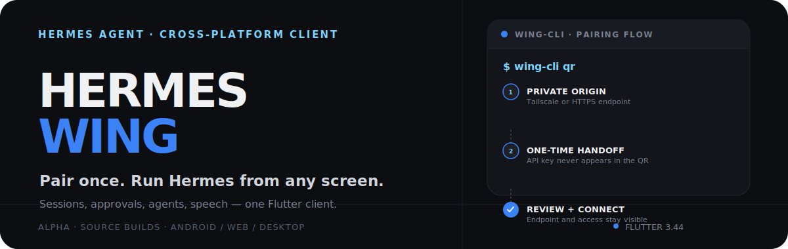
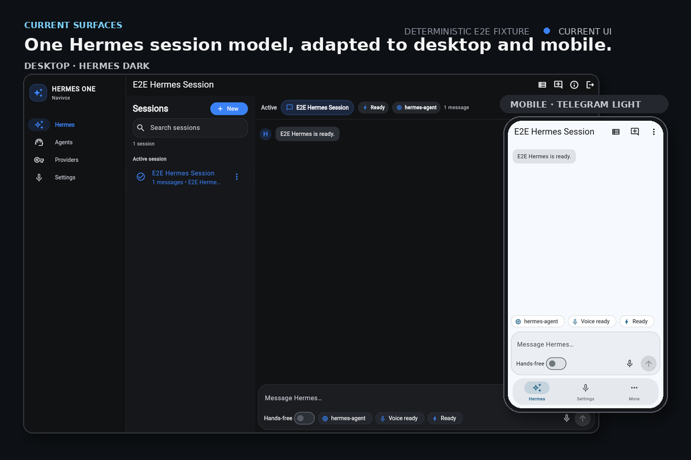
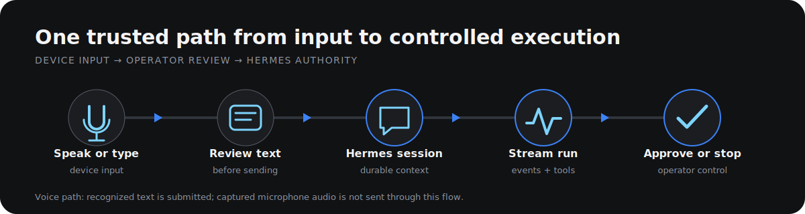

<p align="center">
  
</p>

<p align="center">
  <a href="https://github.com/TrebuchetDynamics/navivox-app/actions/workflows/hermes-platform-smoke.yml"></a>
  <a href="#project-status"></a>
  <a href="LICENSE"></a>
</p>

<p align="center">
  <strong>The canonical cross-platform Flutter client for <a href="https://github.com/NousResearch/hermes-agent">Hermes Agent</a>.</strong><br>
  <sub>Successor to Hermes Desktop · source-distributed alpha</sub>
</p>

<p align="center">
  
</p>

<p align="center"><sub>Current interfaces captured against Navivox's deterministic browser fixture; no private endpoint, credential, or transcript data is shown.</sub></p>

## What Navivox does

Navivox connects to a trusted Hermes Agent API endpoint and adapts the same
session model to phone, web, and desktop layouts.

- **Sessions and runs** — create and manage sessions, stream assistant and tool
  activity, stop active work, and render rich Markdown replies.
- **Operator control** — review approval requests inline instead of silently
  allowing sensitive actions.
- **Agents and models** — manage profiles, providers, model assignments, and
  auxiliary task models when the endpoint advertises those capabilities.
- **Device speech** — request operating-system speech recognition, review the
  resulting text, then submit it to Hermes. Optional continuous voice rearms
  bounded recognition sessions and can speak completed replies.
- **Adaptive interface** — Telegram-light mobile ergonomics and a
  Hermes Desktop-inspired dark workspace share one Flutter codebase.

## How it works

<p align="center">
  <picture>
    <source media="(max-width: 600px)" srcset="./assets/readme/runtime-flow-mobile.svg">
    
  </picture>
</p>

Navivox discovers `/v1/capabilities` before enabling endpoint features. Hermes
Agent remains authoritative for profiles, sessions, tools, runs, approvals,
and configuration; Navivox does not parse Hermes files or mirror its backend.
HTTP handles commands and resources while SSE carries typed run events.

## Start from source

> [!IMPORTANT]
> Navivox is alpha software. There are no signed public binaries or store
> releases yet.

Prerequisites: **Flutter 3.44.2** and the platform SDK for your target.

```bash
git clone https://github.com/TrebuchetDynamics/navivox-app.git
cd navivox-app
flutter pub get
flutter run -d <device-id>
```

Then connect to a trusted Hermes endpoint:

| Target | Endpoint example |
| --- | --- |
| Same desktop host | `http://127.0.0.1:8642` |
| Android emulator → host | `http://10.0.2.2:8642` |
| Physical device or remote desktop | HTTPS, VPN, Tailscale, or isolated LAN URL |

Navivox asks for explicit confirmation before sending a bearer credential to a
non-loopback plaintext HTTP endpoint. See the
[Android setup guide](docs/runbooks/android-hermes-setup.md) and the
[Hermes compatibility contract](docs/product/hermes-compatibility.md).

## Project status

| Platform | Current evidence | Status |
| --- | --- | --- |
| Android | Debug build and optional emulator integration smokes | Experimental alpha |
| Web | Release build and deterministic browser smoke | Alpha, text-focused |
| Linux | Release build | Alpha, text-focused |
| Windows | Debug compilation | Build-tested only |
| iOS | Simulator debug compilation | Build-tested only |
| macOS | Debug compilation | Build-tested only |

Voice input requests the operating system's on-device recognition interface on
Android, iOS, macOS, Windows, and web. Availability and offline behavior depend
on the installed recognizer and device policy. Linux voice input is currently
unavailable, and a repeatable physical-device microphone receipt has not yet
been recorded.

## Security and privacy boundaries

- Bearer credentials use the platform secure-storage implementation; hardware
  backing and backup behavior vary by platform.
- Endpoint metadata is stored separately in shared preferences.
- Recognized words are excluded from diagnostic logs.
- The voice path submits completed text to Hermes, not captured microphone
  audio.
- HTTPS is recommended for remote endpoints. Plain HTTP can expose credentials
  and conversation data outside a trusted encrypted network.
- Authorization is enforced by Hermes Agent capabilities and scopes, not by
  hidden client controls alone.

Read [SECURITY.md](SECURITY.md) and the
[threat model](docs/security/threat-model.md) before deploying outside a local
or encrypted private network.

## Compatibility and known limits

Navivox negotiates compatibility rather than claiming a fixed Hermes release
range. A compatible server must provide `/health`, `/v1/capabilities`, and the
advertised session or run endpoints used by the client.

Current limits:

- No signed packages or store distribution.
- Windows, iOS, and macOS are compilation-tested, not release-supported.
- Hermes server audio and realtime audio are not wired; voice submits text.
- Remote transcript media and client-path attachments remain deferred.
- Optional Hermes inventory can fail independently of an otherwise healthy
  connection; Navivox reports those failures separately from empty results.

## Development

```bash
dart format --output=none --set-exit-if-changed lib test integration_test
flutter analyze
flutter test --concurrency=1
flutter build web --release -t lib/main_e2e.dart
npm ci
npm run web:e2e
npm audit
```

Optional offline text-to-speech uses the pinned
[`pocket_speech`](https://github.com/TrebuchetDynamics/pocket-speech-dart)
package with operator-selected Kitten or Kokoro voice packs.

## Project map

- [Documentation index](docs/README.md)
- [Hermes compatibility](docs/product/hermes-compatibility.md)
- [Hermes Desktop parity ledger](docs/product/hermes-desktop-parity.md)
- [Architecture decisions](docs/adr/README.md)
- [Alpha release runbook](docs/runbooks/release-alpha.md)
- [Contributing](CONTRIBUTING.md)
- [Changelog](CHANGELOG.md)

## License

Navivox is available under the [MIT License](LICENSE).
